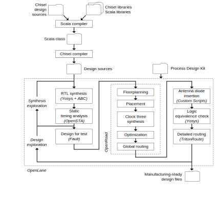

<!-- headingDivider: 3 -->

# **Introduction to Chip Design**

**Martin Schoeberl and Luca Pezzarossa**

## Welcome

 * Learn the basics of chip cesign
 * Design and fabricate your own chip (ASIC)
 * We will use open-source tools only
 * This is a new 13 weeks course
    * We will adapt to your needs and interests
    * Did an open-source chipdesign course as special course before
 * Will have rough edges
 * I am exciting to see you building your own chips

## Introduction Round

 * Who we are?
 * Who are you?
 * Why this course?
 * What is your background?

## The Exponential Growth

 * Moore's Law

## Dennard Scaling

 * Power density
---

---

## TODO

 * OpenLane
 * Tiny Tapeout
 * SkyWater PDK
 * efabless chip for a (virtual) tapeout
 * Show the flow
