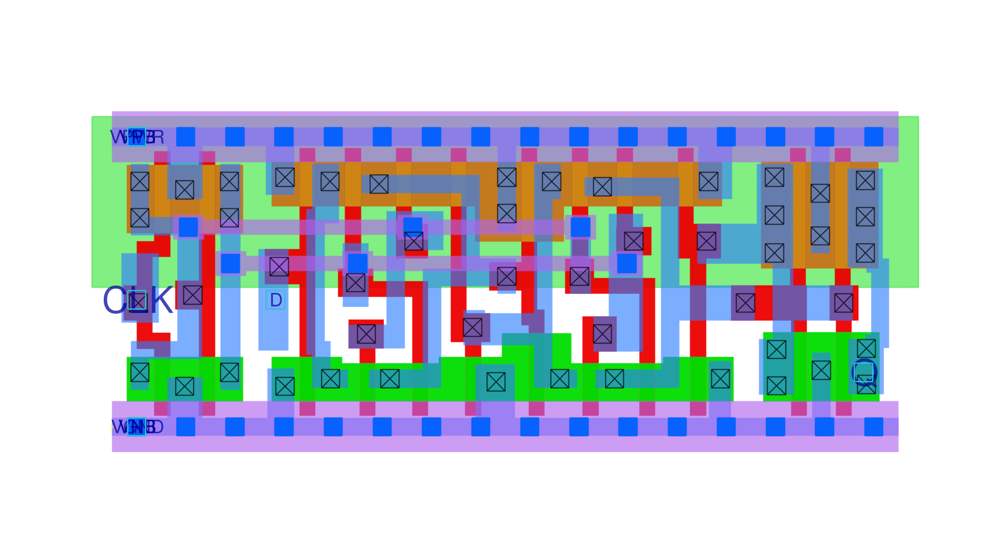

<!-- headingDivider: 3 -->

# **Standard Cells, Memory, and Register Files**

**Martin Schoeberl**

## What are Standard Cells?

- Pre-designed logic gates and flip-flops
- With a uniform height and power rail structure
- Enable automated design through place-and-route (PnR) tools

## Why Use Standard Cells?

- Simplifies digital design process
- Improves design consistency and manufacturability
- Enables efficient use of silicon area
- Supports various power, performance, and area (PPA) trade-offs
- Alternative is full-custom design
  - More effort, but better performance
  - Maybe used for critical parts of a chip

## Standard Cell Library

- Logic gates (AND, OR, NOT, XOR, etc.)
- Sequential elements (Flip-flops, Latches)
- Buffers and Inverters
- Multiplexers and Special Cells (e.g., clock gating cells)

## Examples

- [Inverter](https://sky130-unofficial.readthedocs.io/en/latest/contents/libraries/sky130_fd_sc_hd/cells/inv/README.html)
- [NAND Gate](https://sky130-unofficial.readthedocs.io/en/latest/contents/libraries/sky130_fd_sc_hd/cells/nand2/README.html)
- [D Flip-Flop](https://sky130-unofficial.readthedocs.io/en/latest/contents/libraries/sky130_fd_sc_hd/cells/dfxtp/README.html)

## Standard Cell Characteristics

- **Cell Height:** Fixed for all cells in a given technology node
- **Cell Width:** Varies based on functionality and drive strength
- **Power and Ground Rails:** Uniform across cells for easy connectivity
- **Drive Strength Variants:** Different versions of the same logic gate to optimize power and speed

## Fabrication and Layout

- Standard cells are arranged in rows within an IC
- Each row shares common power (VDD) and ground (VSS) rails
- Cells are designed to minimize routing complexity
- [Example Wildcat Design in Tiny Tapeout](https://legacy-gltf.gds-viewer.tinytapeout.com/?model=https://schoeberl.github.io/tt10-wildcat/tinytapeout.gds.gltf)

## Power, Performance, and Area (PPA) Considerations

- **High-speed cells:** Larger size, more power consumption
- **Low-power cells:** Smaller size, reduced power, but slower speed
- **Trade-offs:** Selecting appropriate cells based on design constraints

## Skywater Standard Cell Designs

- Open-source standard cell library for 130nm technology
- Available on GitHub
- Provides a variety of cells for digital design
- https://sky130-unofficial.readthedocs.io/en/latest/index.html
- [Cell list](https://sky130-unofficial.readthedocs.io/en/latest/contents/libraries/sky130_fd_sc_hd/README.html)

## Summary

- Standard cells are the building blocks of digital IC design
  - standard hight, variable width
- Enable efficient automated design and manufacturing
- Optimize trade-offs between power, performance, and area

