<!-- headingDivider: 3 -->

# **Standard Cells and how to automate the physical design**

**Ole Richter**

## Using Chisel

 * Reminder to learn Chisel
 * Easy to learn in self-study
   - Use the [Chisel book](https://www.imm.dtu.dk/~masca/chisel-book.html)
   - Do the [Chisel lab](https://github.com/schoeberl/chisel-lab)

## Automation

- last week devices and gates, but how to use them in an automated fashion
- assembly of multiple transistors is complex to automate
- how to we make it most simple for the computer

## Building blocks

- have a libaray of predesiged cells
- base your design on the library

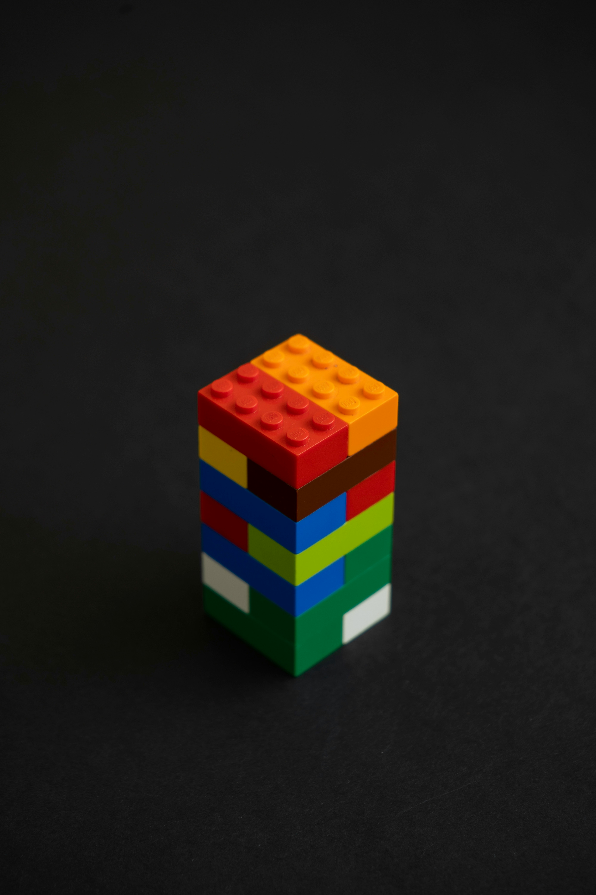

## What are Standard Cells?

- Pre-designed logic gates and flip-flops
- With a uniform height and power rail structure
- Enable automated design through place-and-route (PnR) tools

## Grids, Tracks and Abutment

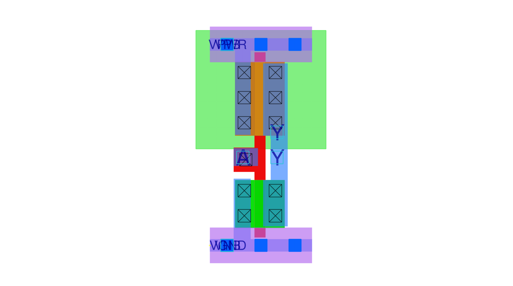 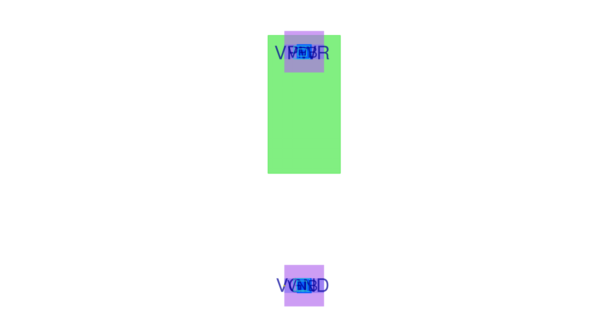 

## Standard Cell Characteristics

- **Cell Height:** Fixed for all cells in a given technology node
- **Cell Width:** Varies based on functionality and drive strength
- **Power and Ground Rails:** Uniform across cells for easy connectivity
- **Drive Strength Variants:** Different versions of the same logic gate to optimize power and speed

## Standard Cell Library

- delivered by the manufacturer or by design houses
- come in different flavours, high densety, low power
- Logic gates (AND, OR, NOT, XOR, etc.)
- Sequential elements (Flip-flops, Latches)
- Multiplexers and Special Cells (e.g., clock gating cells)
- Filler Cells

## Logic Gates
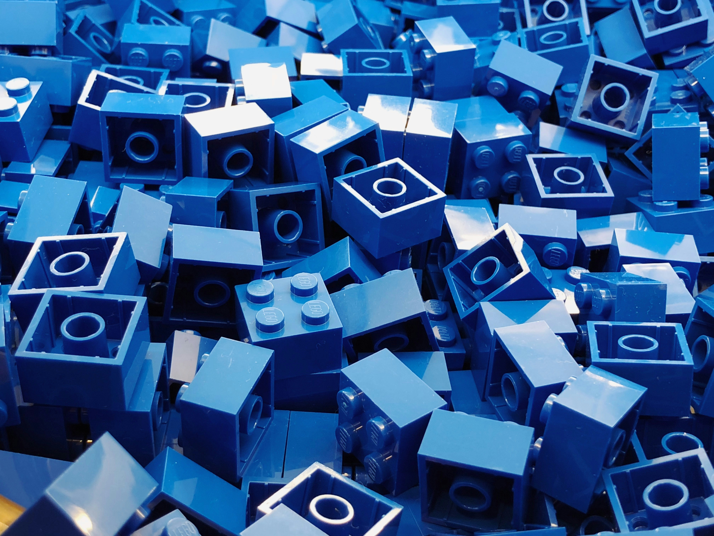 
- NANDs, NORs, inverters 
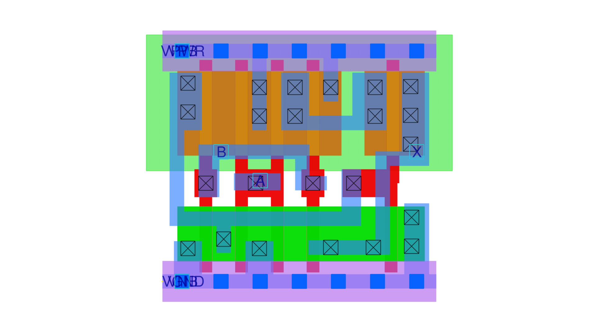 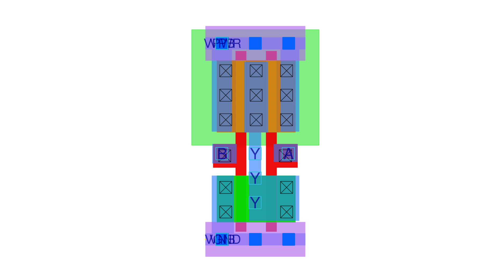

2-input XOR gate (left) 2-input NAND gate (right)

## Statholding Gates
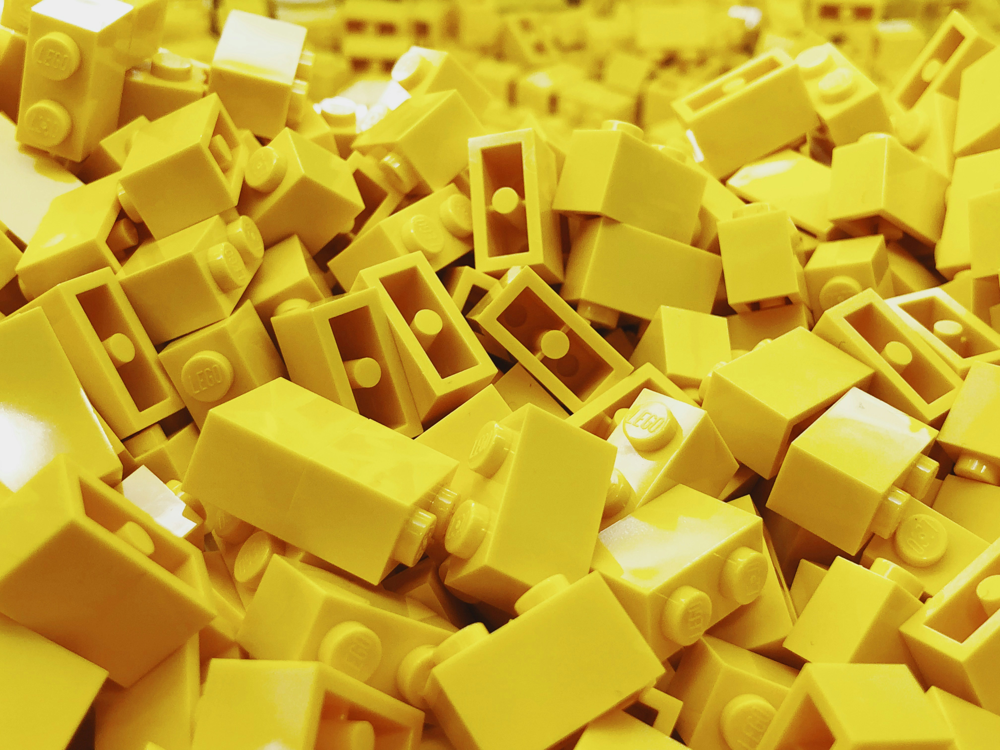
- Flip-Flops, Latches 
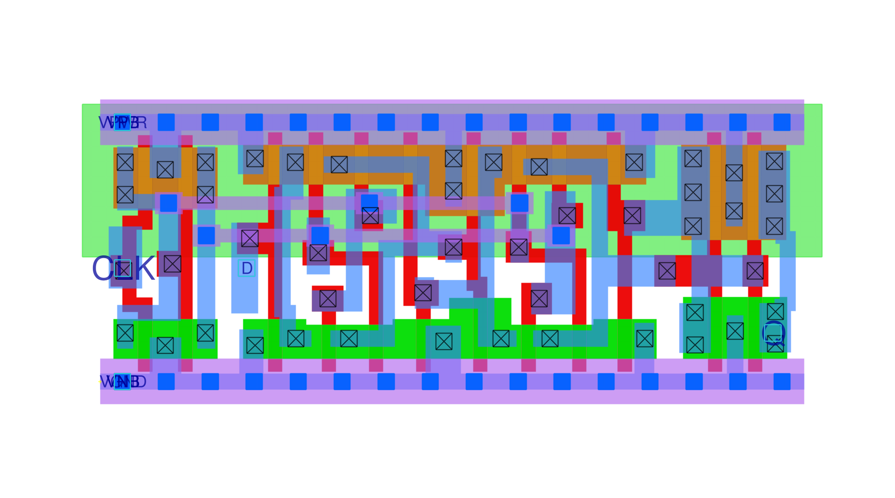
- [how does a Flip-Flop work, by Matt Venn](https://www.youtube.com/watch?v=5PRuPVIjEcs)

## Clock Gates

[height:120px](figures/L3/iker-urteaga-TL5Vy1IM-uA-unsplash.jpg)
- like logic gates but balanced in switching points !

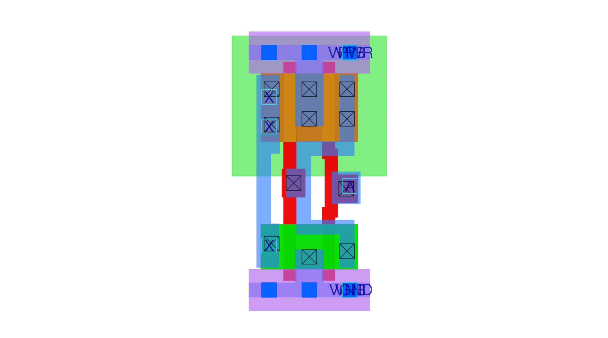 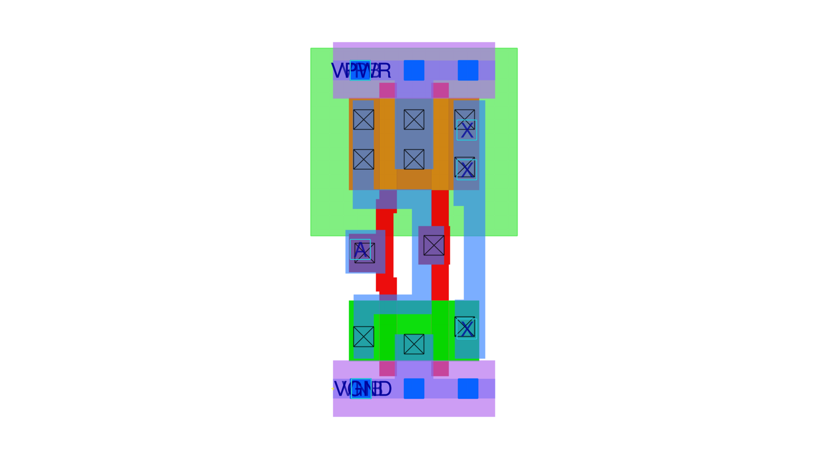

clock buffer (left) logic buffer (right)

## Filler Cells

- to fill the gaps 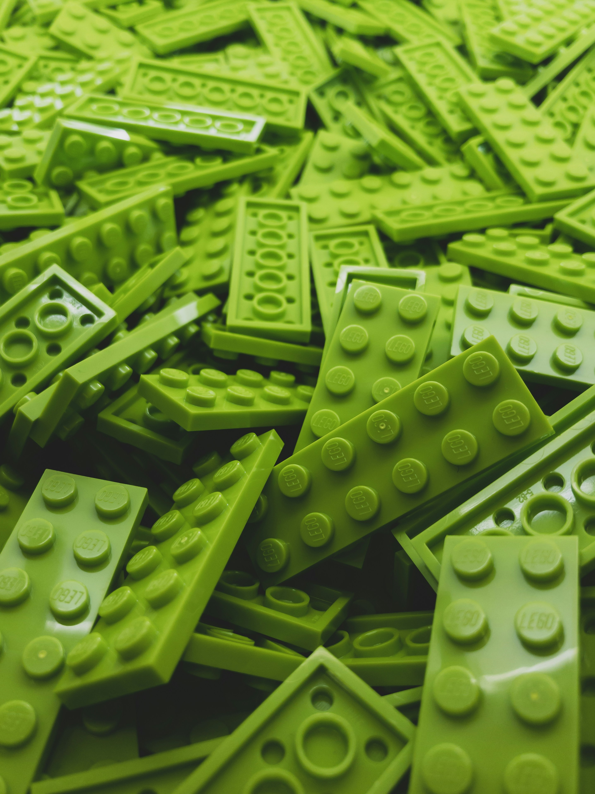
- to have decoupling capacitance 
 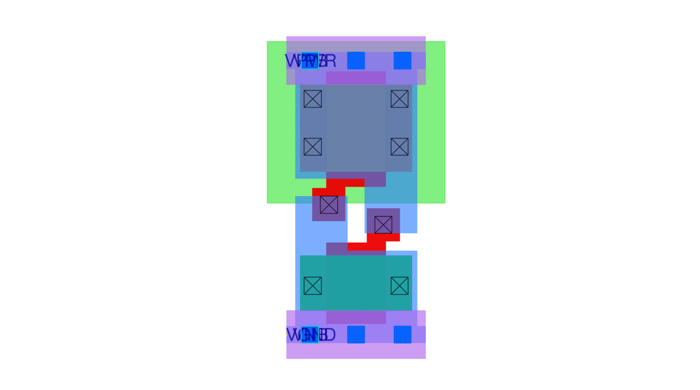 
Filler width 1 (left) decap width 3 (right)

## Power, Performance, and Area (PPA) Considerations

- **High-speed cells:** Larger size, more power consumption
- **Low-power cells:** Smaller size, reduced power, but slower speed
- **Trade-offs:** Selecting appropriate cells based on design constraints

## LEF Library Exchange Format

- describes place holders
- includes all info needed for routing and placement
- capacitance, pin locations, blockages
- open standard

## Fabrication and Layout

- Standard cells are arranged in rows within an IC
- Cells are arranged to keep wireing length short, and timing contraints in check
- [Example Wildcat Design in Tiny Tapeout](https://legacy-gltf.gds-viewer.tinytapeout.com/?model=https://schoeberl.github.io/tt10-wildcat/tinytapeout.gds.gltf)

## LIB Liberty File

- Functional description
- includes delay-load tables
- open standard

## Skywater Standard Cell Designs

- Open-source standard cell library for 130nm technology
- Available on GitHub
- Provides a variety of cells for digital design
- https://sky130-unofficial.readthedocs.io/en/latest/index.html
- [Cell list](https://sky130-unofficial.readthedocs.io/en/latest/contents/libraries/sky130_fd_sc_hd/README.html)

## Summary

- Standard cells are the building blocks of digital IC design
  - standard hight, variable width
- Enable efficient automated design and manufacturing
- Optimize trade-offs between power, performance, and area

