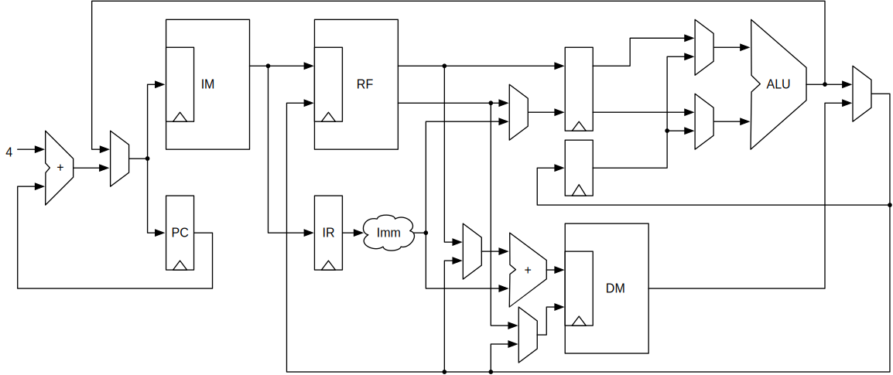
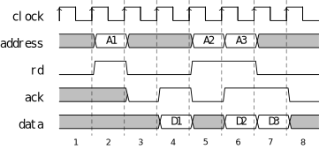

<!-- headingDivider: 3 -->

# **Start the Project**

**Martin Schoeberl**

## You are Ready to Start

 * You added a Wishbone interface to Caravel in week 4
 * You tested that interface in week 5
   - Did you?
 * Now we can start the project
 * a MVP running today

 ## The Project

 * We aim for a common project
 * A simple system-on-chip (SoC)
 * With a CPU, memory, and some IO
 * Hosted on GitHub
   * https://github.com/os-chip-design/dtu-soc-2026
   * Similar to https://github.com/os-chip-design/caravel_leros_2025

## We do a Real Tapeout

 * Sponsored by Edu4Chip
 * Paying $ 15.000 for you
 * This is the first student tapeout at DTU Compute
   - Last chip activity at DTU Compute was 20 years ago
   - Only research chips, no student tapeouts
 * Probably one of the first student tapeouts in EU (Chips Act)
   - TUM, TAU, KTH, IMT working on it (Edu4Chip)
 * Deadline: 13 May 2026

## What is in for You

 * Your design in a real chip
 * Taping out a real chip in your CV
 * Once in a lifetime chance
 * You get several chips
 * We will have a bringup party later this year

## The PCB with Your Chip


## Wildcat

 * RISC-V CPU core
 * Open-source
 * Written in Chisel
 * Supports RV32I
 * 3-stage pipeline
 * Simple memory interface (PipeCon)
 * https://github.com/schoeberl/wildcat


## Wildcat Pipeline



## Wildcat Papers

 * Martin Schoeberl. The Educational RISC-V Microprocessor Wildcat.
Proceedings of the Sixth Workshop on Open-Source EDA Technology (WOSET), 2024. 
 * Martin Schoeberl. Wildcat: Educational RISC-V Microprocessors.
Architecture of Computing Systems -- ARCS 2025, 2025. [pdf](https://www.jopdesign.com/doc/wildcat-arcs.pdf)
  

## The CPU Interface PipeCon

For this project we define a simple pipelined IO interface, that we
name `PipeCon` for pipelined connection.
The interface consisting of following signals:

```scala
class PipeCon(private val addrWidth: Int) extends Bundle {
   val address = Input(UInt(addrWidth.W))
   val rd = Input(Bool())
   val wr = Input(Bool())
   val rdData = Output(UInt(32.W))
   val wrData = Input(UInt(32.W))
   val wrMask = Input(UInt(4.W))
   val ack = Output(Bool())
}
```

## PipeCon

```PipeConDevice``` itself is an abstract class, just containing the interface:

```scala
abstract class PipeConDevice(addrWidth: Int) extends Module {
   val cpuPort = IO(new PipeConIO(addrWidth))
}
```

## Main Rules Defining PipeCon

 * There are two transactions: read and write
 * The transaction command is valid for a single clock cycle
 * The IO device responds earliest in the following clock cycle with an asserted `ack` signal
 * A read result is valid in the clock cycle `ack` is asserted
 * An IO device can insert wait cycles by asserting `ack` later
 * The CPU may issue a new read or write command in the same cycle `ack` is asserted
 * Fits well for pipelined processors, being parallel to the memory stage

## PipeCon Handshake



## Project Ideas

 * Build a simple SoC with a CPU and some IO
 * Wildcat as CPU
 * More than one Wildcat
   - Multicore
   - Use a network-on-chip (NoC) to connect
     - S4NOC and SlimFlit

## Project Ideas (cont.)

 * Explore different memory solutions
   - OpenRAM
   - DFF memory
   - Flip-flop memory
 * Caches for Wildcat
 * SPI based memory controller (Flash + RAM)

 

## Project Ideas (cont.)

 * Explore different RF solutions
   - RF via DFF
   - RF via memory from Sylvain

## Project Ideas (cont.)

 * Explore different boot solutions
 * We discussed this in week 3
   - Boot with help from RV and Wishbone
   - Boot from SPI Flash
   - Have a boot ROM to load a program from the UART
   - FSM plus UART to load a program
   - Implement in different versions of Wildcat

## Lab Today

 * a MVP as group work
 * Get used to Wildcat
 * Wildcat connected to a pin (= LED)
 * Hardcoded program (blinking LED)
 * Blinking the LED in simulation
 * Harden the design, how big is Wildcat?
 * Wildcat is a submodule in our GitHub repo
 * Update your clone ofthe repo (see README)

## Project Work

 * Decide on your project
 * Write it into the README
 * Evey group shall have at least one commit today!
 * We will start with weekly sprints and short reports