<!-- headingDivider: 3 -->

# **Timing and Physical Design**

**Ole Richter**

## This week

- looking at clock distribution
- intro to the backend (Physical Design)
- physical verification

## Challenges of moving from sim to ASIC

- verified RTL
- syntesised netlist
- standard cells

## Naive steps

- place them
- connect signals and power
- should *work* as in your sim

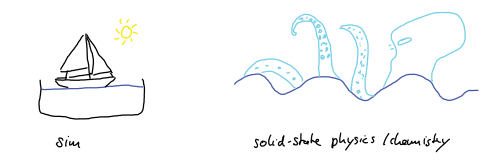
but how to make (Si) "sand" do abstract computation 

## Timing and clock

- the clock is the global *perfect* signal that makes your sim work.

*event* is a signal change 

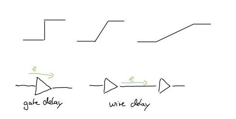

## Timing Delays

## Signal waveform and drive strength

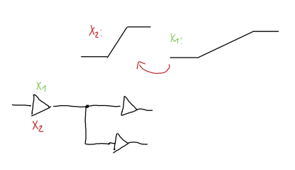

## Clock insertion

what we design
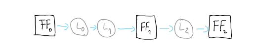

## Clock insertion

the ideal clock (zero delay)
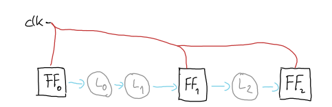

## Clock tree insertion

balanced tree
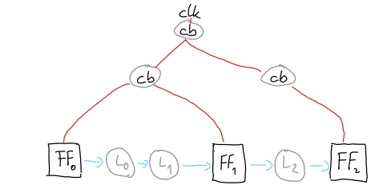

## Clock tree insertion in layout

- wire delay (RC!)
- gate delay 

=> H-tree structure (blackboard)

## Event ordering

a signal change is an event
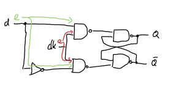

## Timing Quanteties
- Clock distribution delay (Tdis)
- Clock skew (Tskw)
- Clock jitter (Tjit)

=> blackboard

## setup timing
 how much earlier does d have to arrive before clk
 

## setup timing violation

blackboard
<!---->

## hold timing
how long can't d change after clk arrives
 

## hold timing violation

blackboard
<!---->

## skew, jitter of the clock

blackboard

<!--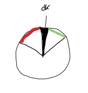 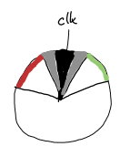-->

## Paracitics
- R and Cs are everywhere 
- two wires running in paralell -> C
- a long wire and the underlining silicon -> C
- a long wire -> R

=> we can extract them

## static timing analysis (STA)

 - get all wire timings & load delays
 - build a timing graph
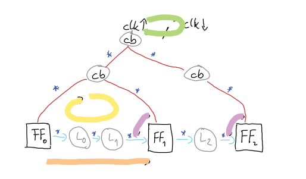

## Timeing Closure

- SPEF delay anotation from layout
- calculate the event ordering and margin:
- calculate all clock times vs hold and setup time

## recap clock

- timing delays
- setup and hold
- critical cycle and path
- timing closure

## Power

- aka Special Route
- the problem: supply bumps + volage drop

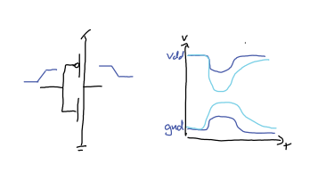

## IR analysis

- resitance of power rails
- locaslised consumtion of all cells
- capacitence in the power network

## Solutions

- wide powerlines, and execive power disrtibution
- Power rings, grids and stripes

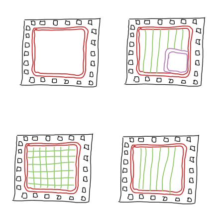

## Decoupling Capacitances

- we talked about them in lecture 3!
- clock syncronised switching
- add capacitances between power rails to stabilised

## Recap power

- dont save on power lines
- also helps for heat (a bit)

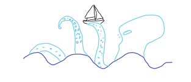

## Phyical Design (Rules)

- rule set of the foundry that is tested
- they are confident that they can produce it for you

## CMOS Fabrication

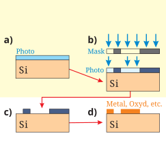 

## CMOS Fabrication

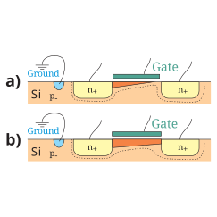

## Spacing 

 
skywater 130 li connect

## minimim width and area

 
skywater 130 metal

## Recap Placement

- core site with specified track number (lecture 3)
- all the work is on the designer, make it easy for the PC
- alternate between 
    - optimal wirelength + timing aware placement 
    - placement legalisation

## Signal Routing

- route on the grid (lecture 3)
- prefered routing directions
- vias on grid points
- the most critical optimisation problem
- more next week!

## Physical Verification

Design Rule Check (DRC)

- check that all spacing are correct
- check that all denceties are fine
- check latch up
- check antenna ratios => blackboard

## Physical Verification II

Layout vs Schematic (LVS)

- extract the netlist from the layout
- compare the layout netlist with the syntesised + simulated netlist

- dont leave gaps in your verification

dont trust the tools, check!

## Conclusion

 - clock and timing
 - power and supply drops
 - design rules & physical verification

 

x``

