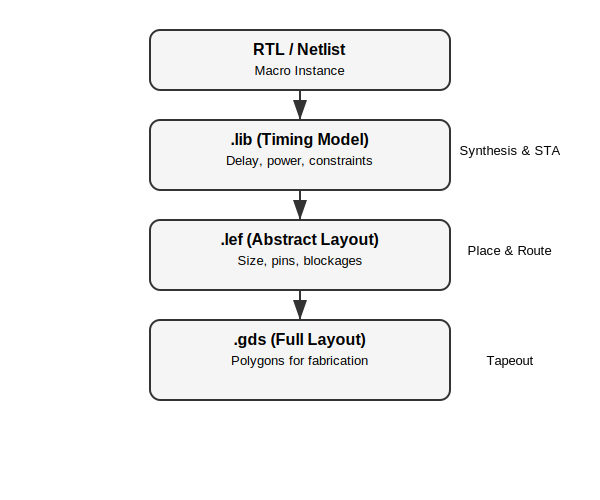

<!-- headingDivider: 3 -->

# **Floorplanning**

**Martin Schoeberl**

## Outline

* Planning your chip: floorplanning
  - Determine the size of the chip 
* Macros
  - How to build and place them
* Connect your chip to pins

## Test the HDMI Sound

 * We might have a remote guest lecture

## DTU Chip Day

 * Save the date: 14 April 2026
 * Danish chip industry (around 20 last year)
 * Presentations and stands
 * Networking for jobs
 * Free sandwiches and free beer ;-)
 * Program and registration at https://chipday.dk/

##

## Why Floorplanning?

 * Die size determines cost
 * Find a minimum silicon area to implement our device
   - But only with reasonable engineering cost
 * Divide and conquer approach
   - Break down complex designs
   - Individually place and route parts of the design
 * Finish subdesigns and include in the top
 * Advanced tools can keep the boundaries fluid
   - To allow more optimization

## Initial Estimates

 * Netlist gives us a first estimate
   - `xx-yosys-synthesis/reports/stat.rpt`
   - But cells cannot be placed without space
     - Additional area to bring power, tap cells,...
     - Space needed for further optimization (clock tree, clock buffers to fix timing)

## Estimating the Area

 * The area needed will be larger than the netlist estimate
   - Core utilization = cell area / reserved core area
 * You define the area by *estimating* the core utilization
   - TT uses 60%,  common (conservative) number
     - "PL_TARGET_DENSITY_PCT": 60
   - You can play with this number with your design
     - In the config file
   - Iterative process, going through the backend flow

## Further Constraints

 * Space around macros not aligned with the standard cell rows
 * Packaging
 * I/O cells
   - Chip size is often determined by I/O and not logic

## Leros Example Design

 * Test tapeout with 4 Leros processors
 * Exploring different memory options
 * Test a register file macro
 * Memories as macros
   - Individually hardened
   - Or given (the CF SRAM)
 * Leros cores freely routed as macros with the memories placed
 * The Leros processors were then placed at the top level

## Leros SoC

## Example from Lab 4
   - Example design from Lab 4:
     - Yosys report: Chip area for module '\adder': 863.328000
     - Floorplan area:
       - "design__die__area": 3330.05
	   - "design__core__area": 1689.12
   - Without constraining, the tools choose the *easy* solution
     - Large die area and place the cells with a lot of space

## Lab 4

## What is a Macro?

 * Chips are usually not synthesized, placed, and routed in one go
 * Parts can be hardened individually
   - Then integrated into the top-level
 * The individually hardened block is called a macro
 * Need to be placed in the outer macro or top level
 * Examples:
   - Memories (e.g., SRAM, register files)
   - I/O cells
   - Custom designs

## Content of a Macro

 * A macro contains the layout
 * Also timing and power information
 * Different files for different purposes
   - LEF for place and route
   - GDSII for final layout and manufacturing
   - .lib for synthesis and STA
   - Verilog for simulation
   - SDC for timing constraints
   - SDF for timing info (not supported by LibreLane)

## Advantages of Macros

 * Faster place and route
   - Example: pre-harden a latch-based memory
   - Upper level only needs to place and route the logic around it
 * Can be reused across designs (e.g., instruction and data memories)
 * Can be black-boxed (closed-source designs)

## Macro Challenges

 * We need timing information for the macro block
   - Does this work well with LibreLane?
* Clock tree cannot be optimized over macro boundaries
 * Constraints the layout (floorplan)
 * What is the right level of using pre-hardened macros?

## Macro Files: LEF

 * Library Exchange Format (LEF)
   - Defines the interface
     - Size of the macro
     - Pin placement
     - Obstractions for layers
   - Used during PnR (Place and Route)
   - [RF Example](https://github.com/os-chip-design/caravel_leros_2025/blob/main/macro/rf_top.lef)

## Macro Files: GDSII

 * Graphic Design System II Format (GDSII)
   - *de facto* industry standard for data exchange of ICs
 * Full layout geometry
   - Shapes on all layers
   - Layers are just numbers
   - Which layer contains what is PDK specific
 * Used for final layout and manufacturing
 * Only binary file format (to save space)

## Macro Files: LIB/.lib

* Liberty format (.lib)
  - Timing and power info
  - Used during synthesis and STA
  - [RF Example](https://github.com/os-chip-design/caravel_leros_2025/blob/main/macro/rf_top.lib)
* Generated when synthesising the macro
* Info used in the next level synthesis and STA
  - Does it work in LibreLane?
* Explore it in an experiment

## Macro Files: Verilog

 * The gate-level netlist
   - Can be used for simulation
   - Maybe used during STA (Static Timing Analysis)
 * High-level simulation models
   - [RF Example](https://github.com/os-chip-design/caravel_leros_2025/blob/main/macro/rf_top.v)

## Macro Files: SDC

 * Timing info
 * Synopsys design constraints (SDC)
   - Timing constraints for the macro
   - Used during synthesis and STA
   - [user_project_example.sdc](https://github.com/os-chip-design/caravel_leros_2025/blob/main/sdc/user_proj_example.sdc)

## Macro Files: SDF

 * Standard delay format (SDF)
   - Represents timing info
   - IEEE standard
   - Currently not supported by LibreLane :-(
     - A spot to contribute to LibreLane ;-)

## Macro Views - the Big Picture

## How Tools Treat Macros

* Synthesis
  - Uses `.lib` -> knows timing
  - Treats macro as a *black box*
* Place & Route
  - Uses `.lef` -> knows size + pins
  - Places macro as a *fixed block*
* Tapeout
  - Uses `.gds` -> includes full layout
* Tools never look inside the macro during the normal flow

## Further Reading on Macros

 * [Using Macros in LibreLane](https://librelane.readthedocs.io/en/stable/usage/using_macros.html)

## Initial Floorplan

 * Plan area for I/O pads
 * Place macro cells
   - E.g., memories
   - Presynthesized blocks
   - Make sure pins connect well
 * Define core area
   - Where the standard cells live
 * Have seen it done in PowerPoint!

 
## Our Project

 * I/O cells are already placed in Caravel
 * Caravel determines the core area (10 mm2)
 * Memories will be macros to be placed
   - Instruction and data memories
   - An experimental register file
 * We can use the rest of the core area for standard cells
 * We can also individually harden sub-projects

## Leros Example

 * Macros at multiple levels
   - A hierarchy of macros
 * Different versions of memories used (4 Leroses)
   - Each Leros is a macro
   - Each memory itself is a macro
 * [Leros example with DFF memory](https://github.com/os-chip-design/caravel_leros_2025/blob/main/openlane/leros-dffram/config.json)

## Break and Midterm Course Evaluation

 * Let us have it now
   - What do you like
   - What you don't like
   - Proposals for change
 * I take notes (in our shared Google doc)
 * We can adapt the second half of the course

## Connect the Die to Package Pins

 * Select a package
   - How many I/O pins do we need?
 * I/O from the die is connected with wire bonding
   - Or as a flip-chip with solder bumps

## Simple Chip Bonding

## Today

## I/O Issue

 * The number of transistors still grows exponentially
   - E.g., TSMC has grown transistor density 2x per year
 * I/O data rates only been 2x every 4 years
 * Number of pins has not been increasing exponentially
 * Pads for the pins need space

## Xilinx

## Upgrading Old Designs

 * For example, the automotive chip crisis
 * Intel has been proposing to upgrade old designs to new processes
   - E.g., Intel 16 in Ireland
 * But then those are pad limited
   - Need larger dies just for the pads
   - The higher price per mm2 does not scale well

## Making the Die Bigger

 * When the die is pad limited
 * Use the space for very large caches
   - E.g., AMD Infinity cache: 32 MB on chip
 * Then pressure on the I/O (memory) bandwidth decreases
 * But larger dies have a lower yield
 * Another option is Chiplets
   - Multiple dies in one package
   - With high-speed interconnects

## AMD

## Next Step

 * 3D packaging
 * Multiple dies stacked on top of each other
   - Processor, DRAM, Flash
   - With through-silicon vias

## Reading on Advanced Packaging

 * https://newsletter.semianalysis.com/p/advanced-packaging-part-1-pad-limited
 * https://newsletter.semianalysis.com/p/advanced-packaging-part-2-review

## Open-Source PDKs

 * This chip design/production world has changed a lot in recent years
 * SkyWater and Google started it
 * But there is more
   - IHP 130
   - GF 180

## SkyWater

 * [SkyWater](https://en.wikipedia.org/wiki/SkyWater_Technology) was former Cypress
   - Cypress made fast SRAMs
 * Opened up their 130 nm process in 2020
   - SkyWater, Google, and Efabless
   - Now, chipfoundry is doing the MPW
 * 10mm2 packaged dies for $ 15000
 * Just reserved a [slot](https://platform.chipfoundry.io/projects/6498d2f1-fdcf-498d-ade0-26f48bf48ec8) for our project
 * Used by Tiny Tapout

## IHP

 * Leibniz Institute for High Performance Microelectronics ([IHP](https://en.wikipedia.org/wiki/Innovations_for_High_Performance_Microelectronics))
 * Research institute in Germany
   - In Frankfurt (Oder), former GDR
   - Hosted last year's [FSiC](https://wiki.f-si.org/index.php/FSiC2025) conference
 * Opened their PDK in 2021
 * 1500-1000 EUR/mm2
 * Used by Tiny Tapout
   - Rescued TT09 and TT10 shuttles

## GlobalFoundries

 * 180 nm process
 * Open-source [PDK](https://gf180mcu-pdk.readthedocs.io/en/latest/) with Google (2022)
 * MPW organized by [waver.space](https://wafer.space/)
   - Startup by Tim Ansell (did the Google OS PDK)
   - $ 7000 for 20mm2 bare dies
   - 1000 dies or wire bonded
   - Could be an option for a startup project

## Summary

 * Floorplanning is part of chip design
   - Determines the area (and shape) of the ASIC
 * Standard cells are placed in the core area
   - Need some extra space (cell utilization)
 * We need hard macros, such as memories
   - Need extra room for placement
 * Floorplan and macro pin assignment need to *fit*
   - To be able to route the signals

## Have a Project Reporting Round

 * Each group has 5 minutes to present
   - Their status
   - Current challenges
   - Next steps
 * BTW: 8 weeks till tapeout deadline

## TODO List

 * In the [README](https://github.com/os-chip-design/dtu-soc-2026?tab=readme-ov-file#needed-work) of our project
   - If you don't like it, public, we can use our Google doc
 * Distribute tasks to groups

## Needed Work (TODO List from the README)

- [ ] CI with LibreLane synthesis
- [ ] Add Wildcat in repo (like the exercise)
- [ ] Wildcat boot from WB
- [ ] CI with Wildcat in the test
- [ ] Check compiler option for RV32IE (16 registers)
- [ ] Block diagram in the README
- [ ] Explore macro timing with LIB files