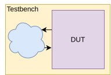

<!-- headingDivider: 3 -->
<!-- colums:2 -->

# **Functional Verification**

**Tjark Petersen**

## Motivation

- Computer chips are everywhere in our daily lives
- Their complexity is increasing
- But how can we be confident that everything works as it should?
- We better be sure, since a tape-out can cost millions!
- We have to verify our design
- It does not add any value but it is a necessary task


## Lecture Overview
- A journey from a bare-bones Verilog/VHDL testbench to modern verification methodologies
- A First-In-First-Out buffer will serve as an example to showcase different verification techniques


## What is Verification
- *"Verification is a process used to demonstrate the functional correctness of a design"* [Bergeron, 2012]
- What is *correct*? We need a *specification*
- But everyone *interprets* the specification
- We need to be careful to avoid ambiguities and false assumptions
- To demonstrate correctness we need to know:
  - What to test
  - And how to test it

## Scenarios & Properties
- We need a translation of features and requirements into something more tangible
- A *scenario* captures how a certain feature may be *triggered* and what the expected behavior should be
- A *property* captures system behavior in a mathematical way involving signal states and possibly time
  - Safety properties ensure that something bad *never* happends
  - Liveness properties ensure that something good *eventually* happens

## The Verification Plan
- A complete *verification plan* is the collection of scenarios and properties which collectively *demonstrate* the functional correctness of the design
- This means that for each feature there should be a scenario or property that can reveil whether the feature is implemented correctly or not
- A complete verification plan *covers* all aspects of the specification
- Writing a complete verification plan is hard, time-consuming and difficult to automate
  - When do you know you are done?

## What is a feature?
- A *capability* of a design and how it should work under a certain *mode of operation*
- A *functionality* of a design which captures how an *operation* may be performed

## FIFO Specification

- **Functionality**:
  - A read/write occurs when ready and valid are asserted in the same clock cycle
  - Writes to the FIFO should be read in the same order
  - Reads should only occur when the FIFO is non-empty
  - Writes should only occur when the FIFO is not full
- **Reset**: After reset the FIFO should be empty

---

- **Performance**:
  - If not full, the FIFO should accept new writes each clock cycle
  - If non-empty, the FIFO should accept reads each clock cycle
  - An item written to an empty FIFO should be available for reading on the output at the next clock cycle


## Features

- **Functionality**:
  - A write handshake places an item in the FIFO
  - A read handshake removes an item from the FIFO
  - Data written to the FIFO should eventually be available for reading
  - A data item written to the FIFO should be available for reading *before* all items written *after* it
  - Writes must not occur when *N* items are in the FIFO (`!in.ready`)
  - The FIFO must accept writes when not full (`in.ready`)
---
  - Reads must not occur when 0 items are in the FIFO (`!out.valid`)
  - The FIFO must accept reads when not empty (`out.valid`)

- **Reset**: The FIFO should signal that it is empty (`!out.valid`) after reset

---
- **Performance**:
  - If not full, the FIFO should assert `in.ready` the clock-cycle after a write
  - If non-empty, the FIFO should assert `out.valid` the clock-cycle after a read
  - Writing to an empty FIFO should result in `out.valid` being asserted the next clock cycle and the `out.data` being the same as the written data

## Scenarios

- Let's develope a scenario for the feature: "Writes must not occur when *N* items are in the FIFO (`!in.ready`)"
- Scenario:
  - Insert *N* items into the FIFO
  - Now `in.ready` should be deasserted
- Is it exhaustive though? What about (add *N*, read 1, add 1)?

## Scenarios

- Let's develope a scenario for the feature: "A data item written to the FIFO should be available for reading *before* all items written *after* it"
- Scenario:
  - Write *N* items to the FIFO with `in.data` being the item number
  - Read *N* items from the FIFO and check that the `out.data` is the same as the item number 

## Now what?

- We have test scenarios, now we need to apply them to the design
- We need to write a *testbench*
- A testbench creates an environment around a design which drives the inputs of a design and may check the outputs
- The testbench may also produce a waveform for visual inspection

## Traditional Testbench

- Traditionally testbenches have been written in a hardware description language (Verilog, VHDL)
- One simulator could be used for both design and testbench
- The testbench is a module without any ports and drives the design inputs
- The testbench may contain non-synthesizable constructs like `#10` for a delay



## FIFO Verilog Testbench

```verilog
always #5 clock = ~clock;

initial begin
  clk = 0; reset = 1; in_valid = 0; in_data = 8'h00; out_ready = 0;

  // Apply reset
  #10 reset = 0; #10;

  // Step 1: Write an item to FIFO
  in_data = 8'hA5; in_valid = 1;
  wait (in_ready);
  #10; in_valid = 0;

  // Step 2: Read the item from FIFO
  #10; out_ready = 1;
  wait (out_valid);

  if (out_data == 8'hA5) 
    $display("TEST PASSED: Correct data read from FIFO.");
  else 
    $display("TEST FAILED: Incorrect data read from FIFO.");
  #20 $finish;
end
```

## Traditional Testbenches
- Pros:
  - Same language as the design
  - Inherently concurrent
- Cons:
  - Manual alignment to clock edges
  - Need to declare explicit signals to connect to DUT
  - Very limited language

## Verification Languages


## OpenVera Example
- Inspired by [Flake, 2020]
```verilog
program check_reset_strobe {
  interface channel {
    input clock CLOCK;
    output reset PHOLD #1; // single-bit signal driven 1 time-unit after the rising clock edge
    input [7:0] data PSAMPLE #1; // 8-bit signal sampled 1 time-unit before the rising clock edge
    input request PSAMPLE; // signal sampled infinitesimal time before the rising clock edge
    output ack NHOLD #2; // signal driven 2 time-units after the falling clock edge
  }
  { // Program entry point
    channel.request = 1 ;
    @0,100 channel.ack == 1 ; // expect strobe to become one within 100 clock cycles
  }
}
```

## Cocotb

```python
@cocotb.test()
async def fifo_single_write_read_test(dut):
  cocotb.start_soon(Clock(dut.clk, 10, units="ns").start())

  ... # Reset

  # Step 1: Write one item into the FIFO
  test_value = 0xA5
  dut.in_data.value = test_value
  dut.in_valid.value = 1

  # Wait for FIFO to accept the write
  while not dut.in_ready.value:
      await RisingEdge(dut.clk)
  await RisingEdge(dut.clk)
  dut.in_valid.value = 0

  # Step 2: Read the item from FIFO
  dut.out_ready.value = 1
  while not dut.out_valid.value:
      await RisingEdge(dut.clk)
  read_value = dut.out_data.value.integer

  assert read_value == test_value, f"TEST FAILED: Expected {hex(test_value)}, got {hex(read_value)}"
  cocotb.log.info("TEST PASSED: Correct data read from FIFO.")
```

## Chiseltest
```scala
test(new Fifo) { dut =>
  // Step 1: Write an item to FIFO
  dut.in.valid.poke(1.B)
  dut.in.data.poke(0xA5.U)
  while(!dut.in.ready.peekBoolean()) dut.clock.step()
  dut.clock.step()
  dut.in.valid.poke(0.B)

  // Step 2: Read the item from FIFO
  dut.out.ready.poke(1.B)
  while(!dut.out.valid.peekBoolean()) dut.clock.step()
  dut.out.data.expect(0xA5.U)
}
```

## Plan
- develop one fifo scenario
- use that scenario to showcase verilog, cocotb, chiseltest
- show chiseltest bfm
- show chiseltest or sv crv
- coverage concept
- show sv coverage
- show chiselverify coverage

## References

- [Bergeron, 2012] J. Bergeron, Writing testbenches: functional verification of HDL models. Springer Science & Business Media, 2012.
- [Flake, 2020] Peter Flake, Phil Moorby, Steve Golson, Arturo Salz, and Simon Davidmann. 2020. Verilog HDL and its ancestors and descendants. Proc. ACM Program. Lang. 4, HOPL, Article 87 (June 2020), 90 pages. https://doi.org/10.1145/3386337