<!-- headingDivider: 3 -->

# **Timing and Physical Design**

**Ole Richter**

## Challenges of moving from sim to ASIC

- verified RTL
- syntesised netlist
- standard cells

## Naive steps

- place them
- connect signals and power
- should *work* as in your sim

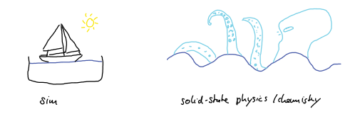

## Timing and clock

- the clock is the global *perfect* signal that makes your sim work.

*event* is a signal change 

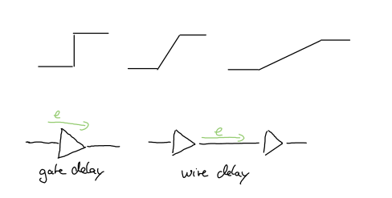

## Timing Delays

## Timing Delays and drive strength

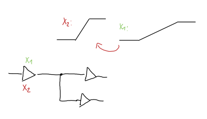

## Clock insertion

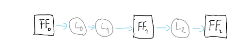

## Clock insertion

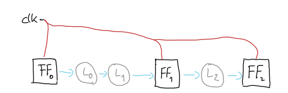

## Clock tree insertion

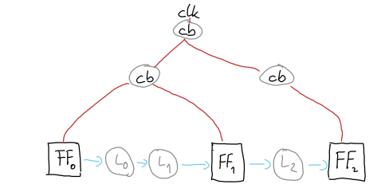

## Event ordering

## setup timing

 

## setup timing

## hold timing
 

## hold timing

## skew, jitter of the clock

 

## static timing analysis (STA)

 - get all wire timings & load delays

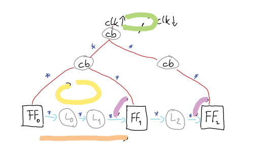

## recap clock

- timing delays
- setup and hold
- critical cycle and path
- timing closure

## Power

- the problem: supply bumps

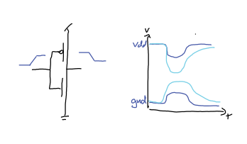

## IR analysis

- resitance of power rails
- locaslised consumtion of all cells
- capacitence in the power network

## Solutions

- wide powerlines, and execive power disrtibution
- Power rings, grids and stripes

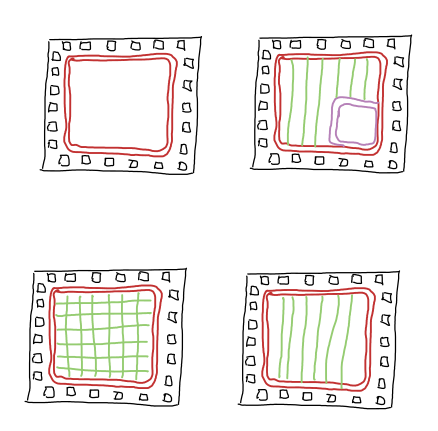

## Decoupling Capacitances

- clock syncronises switching
- add capacitances between power rails to stabilised

## Recap power

- dont save on power lines
- also helps for heat

## Phyical Design (Rules)

- rule set of the foundry that is tested
- they are confident that they can produce it for you

## CMOS Fabrication

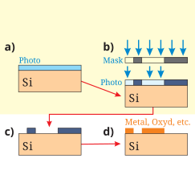 

## CMOS Fabrication

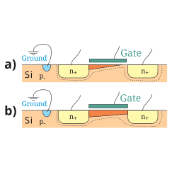

## Spacing 

 
skywater 130 li connect

## minimim width and area

 
skywater 130 metal

## Conclusion

 - clock and timing
 - power and supply drops
 - design rules

 

x``

