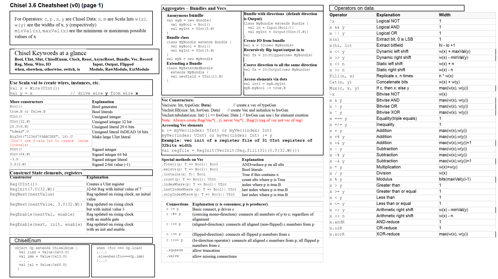

# Week 4 Exercise  
*Open Source Chip Design Course*  
July 2024

## Introduction
The past weeks we have installed all the required tools, and now we want to use them. In this course, you will make a design for TinyTapeout; this is a project where many people share an ASIC to reduce costs to a reasonable level.

## Setup VS Code
At this point, it is highly recommended that you use `Visual Studio Code` to write code on Windows; on other systems, it matters less.

**Windows:**  
To do this, you must first install `VS Code` from [here](https://code.visualstudio.com/). Then you must install the WSL for VS Code from [here](https://marketplace.visualstudio.com/items?itemName=ms-vscode-remote.remote-wsl).

Now, in your WSL terminal, navigate to your Chisel directory:
```bash
cd ~/my_designs/design2/chisel
```

Now you can, in your WSL terminal, write:
```
code ~/my_designs/design2
```

This will open VS Code on Windows and connect it to your WSL instance.

**Linux:**  
If you are using Linux, you can also install VS Code, but you can use any other editor.

**Mac:**  
Good luck

## TinyTapeout!
Now for the goal of the course! This guide will go through how to harden your project locally with TinyTapeout.

### Installation
Firstly, to ensure that the following steps use the right version of Python, you must do: 
```bash
alias python3='python3.11' 
```

Next, you must install an example project called the "factory-test." This is done to test if everything works as expected.
```
git clone https://github.com/TinyTapeout/tt08-factory-test ~/factory-test
```

Now you must do the following, noting that the "OPENLANE2_TAG" might have changed, so please check with the teacher or checkout the TinyTapeout GitHub:
```
export PDK_ROOT=~/ttsetup/pdk
export PDK=sky130A
export OPENLANE2_TAG=2.0.8
```

Now download the TinyTapeout support tools. These will be placed inside the factory-test folder under "tt," and you will set this up for each project you do.
```
cd ~/factory-test
git clone -b tt08 https://github.com/TinyTapeout/tt-support-tools tt
```

Okay, now you also need to set up a TinyTapeout installation. This is done in a Python virtual environment, and it will install its own version of OpenLane2 and other requirements for TinyTapeout:
```
python3 -m venv ~/ttsetup/venv
source ~/ttsetup/venv/bin/activate
pip install -r ~/factory-test/tt/requirements.txt
pip install openlane==$OPENLANE2_TAG
```

This will be a different version than what your existing OpenLane2 is, and you will need both in the future. It is assumed that you are in the virtual environment for the rest of the commands.

Now you must "harden" the factory-test project. You do this by:
```
cd ~/factory-test
./tt/tt_tool.py --create-user-config --openlane2
./tt/tt_tool.py --harden --openlane2
```

Now install the final requirements. Inside the factory-test folder, do:
```
cd test
pip install -r requirements.txt
```

### Factory Testing

Let us now run some tests:

Firstly, run the RTL tests. Navigate to the factory-test's test folder:
Let us now run some tests:
```
cd ~/factory-test/test
```

And do:
```
make -B
```

If this produces an error, you might be using the wrong "iverilog" version. You should use the "apt" version, not the "oss-cad-suite."

You can also run a gate-level test in the same folder:
```
TOP_MODULE=$(cd .. && ./tt/tt_tool.py --print-top-module)
cp ../runs/wokwi/final/pnl/$TOP_MODULE.pnl.v gate_level_netlist.v
make -B GATES=yes
```

You might also want to check for warnings:
```
./tt/tt_tool.py --print-warnings --openlane2
```

You can now exit the virtual environment by:
```
deactivate
```

Before running TinyTapeout, you must enter the Python virtual environment, which you can do by:
```
source ~/ttsetup/venv/bin/activate
```

You can do this from any folder.
For more information on the local hardening process, go to: [TinyTapeout Local Hardening](https://tinytapeout.com/guides/local-hardening/).


## Expand Your Buildtools

Your old makefile does not include TinyTapeout, so you should include a TinyTapeout workflow.

Copy the project from last week:
```
cp -r ~/my_designs/design2 ~/my_designs/design3
```

Like before, download the TinyTapeout Support tools:
```
cd ~/my_designs/design3
git clone -b tt08 https://github.com/TinyTapeout/tt-support-tools tt
```

TinyTapeout requires a git repository to function; therefore, you must create a local dummy repo.
```
git init
git add .
git commit -m "Initial commit"
git remote add origin https://github.com/something/something.git
```


---

## Hand-in Assignment
This shall be handed in before next week. You should submit a document (preferably LaTeX) that answers the following questions.

### 1. TinyTapeout
- Confirm you have a working installation of TinyTapeout as described in the guide.
- Make an image of the factory-test and present it. You can create an image by doing:
    ```bash
    ./tt/tt_tool.py --create-png --openlane2
    ```

### 2. Writing Chisel
You might want to take a look at the following resources:
- [Chisel Bootcamp](https://mybinder.org/v2/gh/freechipsproject/chisel-bootcamp/master)
- [Chisel Book](https://www.imm.dtu.dk/~masca/chisel-book.html)
- [Chisel Tutorial](https://github.com/ucb-bar/chisel-tutorial)
- [Chisel Cheatsheet](https://github.com/freechipsproject/chisel-cheatsheet/releases/latest/download/chisel_cheatsheet.pdf)

The cheat sheet is also in the appendix.

### 3. Toolchain
- Confirm you have a working toolchain that includes TinyTapeout as described in the guide.

### 4. Notes
To remember important steps in the future, it will be a good idea for you to take notes. These will not be evaluated, but you are allowed to submit them together with the rest of your assignment. These notes are only for you and are not required.

## Appendix
Cheat sheet page 1:


Cheat sheet page 2:

